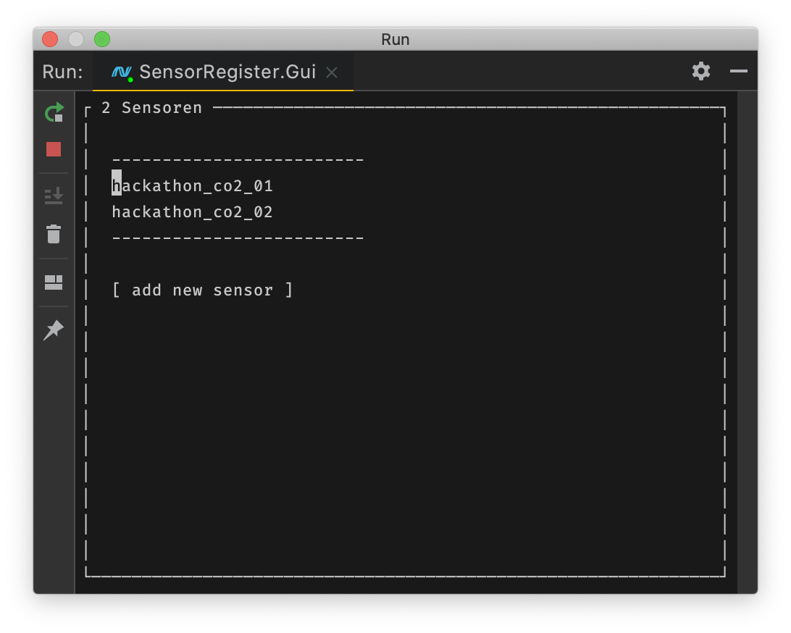
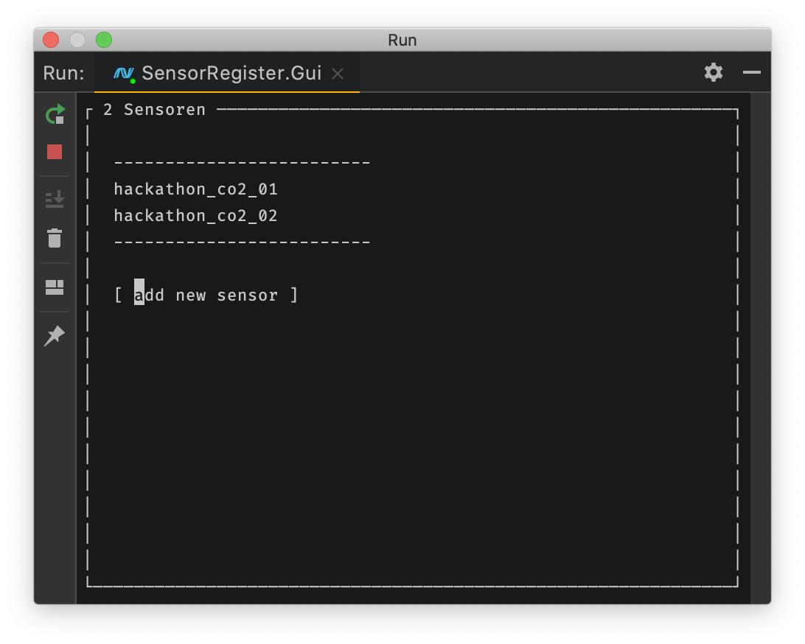
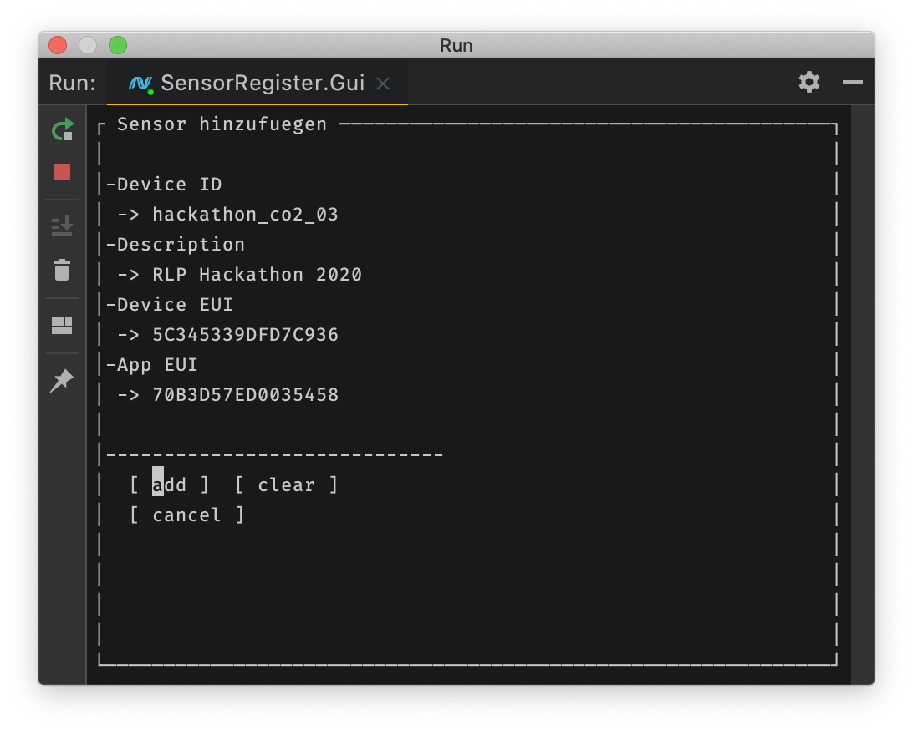
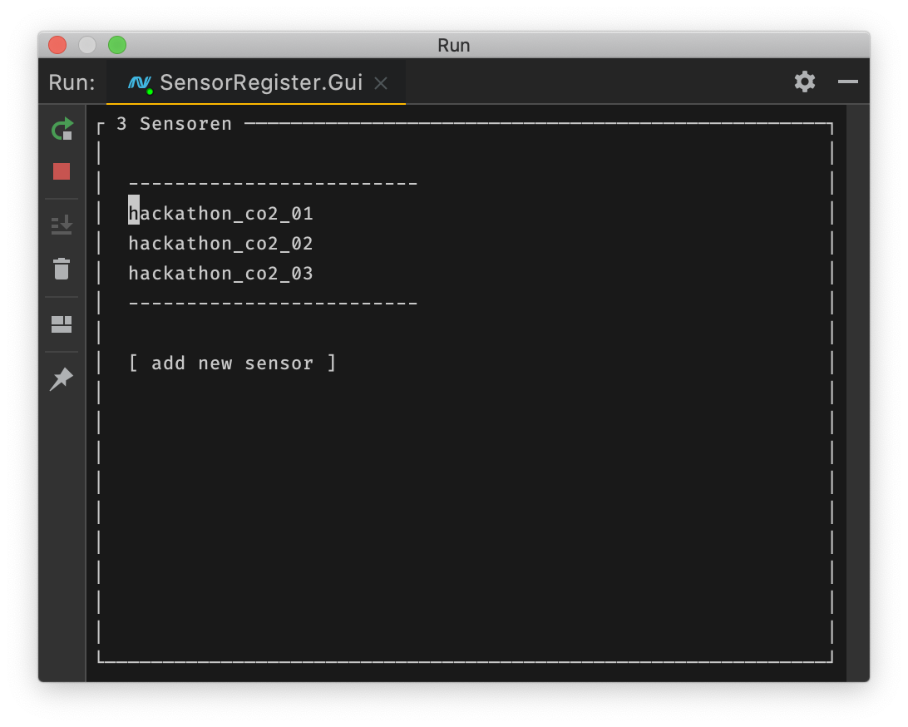

# RLP-Hackathon_2020
## Use Case 2: Wie ist meine aktuelle Luftqualität im Raum?







Der Use Case zielt für den Hackathon auf Schulen (später auf viele andere Anwendungsszenarien), für die Sensoren die C02 Belastung im Raum messen und visualisieren

Für den Use Case werden Sensoren über das TheThingNetwork https://www.thethingsnetwork.org/ angebunden und mit der Plattform https://datacake.co/ ausgewertet.

## Intention
Das Tool dient als Proof-of-Concept für das Ansprechen der jeweiligen APIs um automatisiert Sensoren und Auswertungsdiagramme anzulegen.


## Infos/Links
The Thing Network wird derzeit über die inzwischen obsolete Version V2 der API angesprochen. API Keys finden sich in der Console unter _Applications_

* https://www.thethingsnetwork.org/docs/applications/apis.html


Für die Version 3 scheint eine Migration notwendig
    
* https://thethingsstack.io/
* Cloudversion der V3: https://thethingsstack.io/getting-started/cloud-hosted/

Für DataCake steht eine GraphQL API und eine rudimentäre REST API zur Verfügung. Der nutzerspezifische, anscheinend nicht änderbare (!) API Key findet sich unter 
den Benutzereinstellungen im Bereich _Account bearbeiten_

* Rest API: https://developer.datacake.co/#introduction
* Graph API: https://api.datacake.co/graphql 

---
---
# Development

This demo program helps presenting and updating data of sensors connected to [**thethingsnetwork.org**](https://www.thethingsnetwork.org/) in a [**datacake**](https://datacake.co/) dashboard.

## Todos
- [x] sync with thethingsnetwork.org
- [ ] sync with Datacake dashboard

## Prerequisites

1. .NET Core >= 3.1
2. Create `SensorRegister.Core/Secrets.cs`:
```cs
namespace SensorRegister.Core
{
  public static class Secrets
  {
      public const string DataCakeApiToken = "DATACAKE-API-TOKEN";
      public const string ThingsNetworkApiKey = "THINGSNETWORK-API-KEY";
  }
}
```

## Run
```bash
cd SensorRegister/
dotnet restore
dotnet run --project SensorRegister.Gui
```